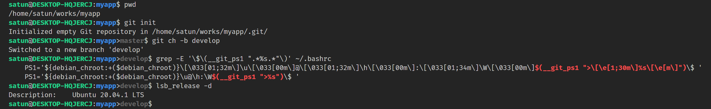
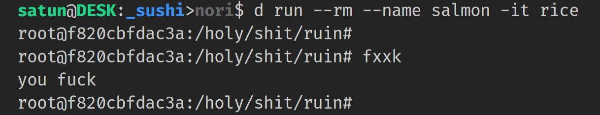
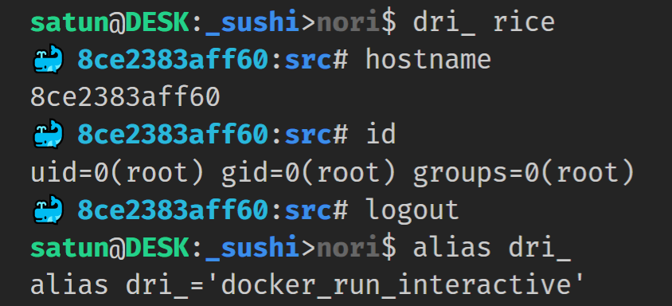
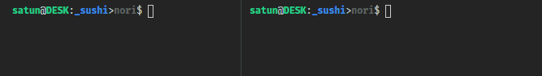
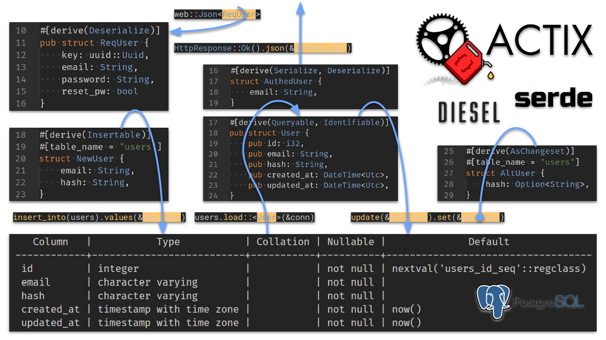

# tips

- [tips](#tips)
  - [git branch at bash prompt](#git-branch-at-bash-prompt)
  - [tagging docker compose intermediate images](#tagging-docker-compose-intermediate-images)
  - [docker command aliases](#docker-command-aliases)
  - [bash prompt in docker container](#bash-prompt-in-docker-container)
    - [Solution:](#solution)
  - [serde and diesel derive attributes](#serde-and-diesel-derive-attributes)
  - [fragment collection parser in `combine`](#fragment-collection-parser-in-combine)

## git branch at bash prompt

To show git branch at bash prompt,

Add like `$(__git_ps1 ">%s")` to `PS1` of `~/.bashrc`:



## tagging docker compose intermediate images

To name each intermediate image of a service of a Compose project,

first name each build stage `AS {stage}` in `{project}/{service}/Dockerfile`:

```Dockerfile
FROM image AS stage
```

Then in `{project}/{service}` dir, build and tag the image targeting `{stage}`.

```bash
docker build . -t $(basename $(dirname $(pwd)))_$(basename $(pwd)):{stage} --target {stage}
```

The image will be tagged as `{project}_{service}:{stage}`.


For alias `dbt`, see [here](#docker-command-aliases).

<!-- ## Thank you for reading! -->

## docker command aliases

[Here](snip/.bash_aliases/docker.sh)
is my docker aliases.

To use this, add to `~/.bash_aliases` as follows:

```bash
. {}/tips/snip/.bash_aliases/.hub.sh
```

For `# myfunc`, see the script of the same name [here](snip/.bashrc).

If you want to use your own function like this, don't forget to add to `~/.bashrc` as follows:

```bash
. {}/tips/snip/.bashrc/.hub.sh
```

## bash prompt in docker container

Here is 2 way to interact with a running container:

* `docker run -it IMAGE COMMAND`
* `docker exec -it CONTAINER COMMAND`

First, run salmon container of rice image. Then...



Holy shit, what a surprising white prompt!

This prompt is the `PS1` itself of `CONTAINER:~/.bashrc`.

No matter how many times it is overwritten, it will return to white next time.

Bye, my ephemeral `PS1`...

### Solution:

Add to `CONTAINER:~/.bashrc` and restart `bash`:

```bash
docker run -ite "DOCKER_PS1='$docker_ps1'" {IMAGE} bash -c 'echo "PS1=$DOCKER_PS1" >>~/.bashrc && bash -l'
```

[Here](snip/.bashrc/docker_run_interactive.sh) is the code I'm actually using, which gives the following result:



Hello, my pseudo-persistent `PS1`!

Let's look at the container counting down on `run -it` (left) from `exec -it` (right).



## serde and diesel derive attributes

actix-web API and DB peripherals, that is, serde and diesel __derive attributes__ are:

* serde
    - __Ser__ ialize
    - __De__ serialize
* diesel
    - Insertable
    - Queryable
    - Identifiable
    - AsChangeset

If used correctly, it could prevent the following:

* Accidentally send x to the outside
* Accidentally update x



## fragment collection parser in `combine`

A parser that combines pieces of information into a single `struct`

[Here](snip/.rs/combine.rs) is snip.

<!-- Thank you for reading! -->

__Thank you for reading!__
